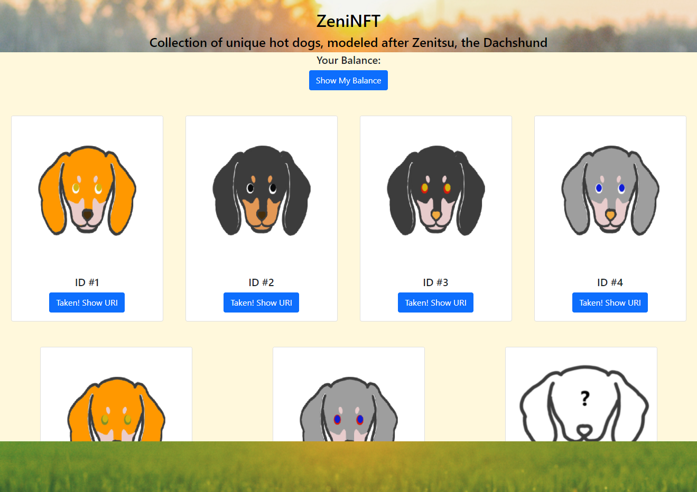

# ZeniNFTs 

## A Collection of Unique Hot Dogs Modeled After Zenitsu, The Dachshund. 

Codebase created with Hardhat and react, exploring NFTs.

## Run locally

1. Clone the repo

```sh
git clone https://github.com/jhoan2/ZeniNFTs.git
```

2. Install the dependencies

```sh
npm install

# or

yarn
```

3. Start the local test node

```sh
npx hardhat node
```

4. Deploy the contract

```sh
npx hardhat run scripts/deploy.js --network localhost
```

5. Update __src/App.js__ with the values of your contract addresses (`greeterAddress` and `tokenAddress`)

6. Run the app

```sh
npm start
```